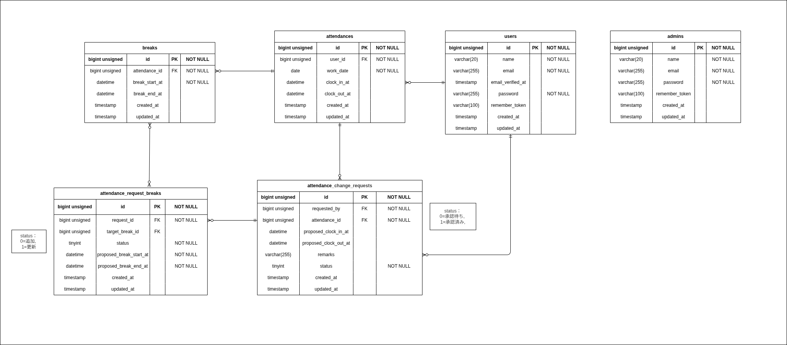

# 勤怠アプリ

## 環境構築

### Docker ビルド

docker compose(v2)を使用してください

```bash
git clone https://github.com/mtired/attendance_management_app.git

cd attendance_management_app
docker compose up -d --build

docker compose exec php bash

composer install

cp .env.example .env
# .env の環境変数を適宜変更してください。

php artisan key:generate
php artisan migrate
php artisan db:seed
php artisan storage:link
```

## 開発環境

一般ユーザ登録画面：
http://localhost/register

一般ユーザログイン画面：
http://localhost/login

管理者ログイン画面：
http://localhost/admin/login

phpMyAdmin：
http://localhost:8080/

MailHog：
http://localhost:8025/

## 使用技術(実行環境)

Laravel：12.11.2

mysql：8.4

nginx：1.28

php：8.4.15

Composer：2.9.5

## ログインユーザ情報

◯一般ユーザ
ユーザ名：TestUser
メールアドレス：user@test.com
パスワード：password

◯管理者
ユーザ名：Admin
メールアドレス：admin@example.com
パスワード：password

## 動作について

### ページ遷移について

#### ゲストページ（未ログイン）

- 登録ページ
- 一般ユーザログインページ
- 管理者ログインページ

#### ログイン済み + メール未認証

- メール認証誘導ページ

#### ログイン済み + メール認証済み + 一般ユーザ

- 勤怠打刻画面
- 勤怠一覧画面
- 勤怠詳細画面
- 勤怠修正申請一覧画面
- 勤怠修正申請詳細画面

#### ログイン済み + 管理者

- 勤怠一覧画面（管理者）
- 勤怠詳細画面（管理者）
- スタッフ一覧画面
- スタッフ別勤怠一覧画面
- 勤怠修正申請一覧画面（管理者）
- 勤怠修正申請詳細画面（管理者）

---

### その他の挙動について

#### 勤怠詳細ページ

- 勤怠の修正申請を行っていない場合は、修正申請が行えます。
- 勤怠の修正申請済みで未承認の場合は、未承認であることが表示され、承認済みになるまでは修正申請が行えません。

## PHP Unitテスト

テスト一括実施コマンド

```bash
php artisan test tests/Feature
```

## ER図


